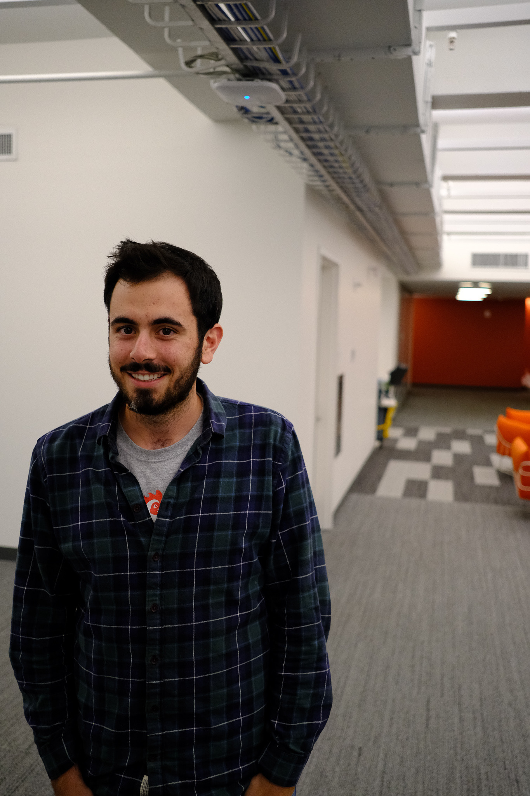

I'm a PhD student in [Computer Science](https://cs.nyu.edu/home/index.html) studying machine learning with [Joan Bruna](https://cims.nyu.edu/~bruna/) in the [CILVR Lab](https://wp.nyu.edu/cilvr/) at the [Courant Institute](https://cims.nyu.edu/) at [NYU](https://www.nyu.edu/). I am interested in scalable and efficient learning for control and decision making problems. Recently I have been mostly working in the offline reinforcement learning setting, trying to understand when and how we can learn effective policies from fixed datasets.

In September 2023, I will be starting as a [research fellow](https://www.harvard.edu/kempner-institute/2023/05/11/announcing-2023-kempner-institute-research-fellows/) at the [Kempner Institute](https://www.harvard.edu/kempner-institute/) at [Harvard](https://www.harvard.edu). 

My PhD was supported by an [NDSEG](https://www.ndsegfellowships.org/) fellowship. In the past I've interned at [Google Robotics](https://research.google/teams/brain/robotics/) in NYC with [Jake Varley](https://scholar.google.com/citations?user=UJcm1MoAAAAJ&hl=en) and [Stephen Tu](https://stephentu.github.io/) on applying offline RL to teleoperated data, at [MSR](https://www.microsoft.com/en-us/research/lab/microsoft-research-montreal/) in virtual Montreal working with [Romain Laroche](https://www.microsoft.com/en-us/research/people/rolaroch/) and [Remi Tachet des Combes](https://www.microsoft.com/en-us/research/people/retachet/) on offline RL, and at [FAIR](https://research.fb.com/category/facebook-ai-research/) in Paris working with [Alessandro Lazaric](https://scholar.google.com/citations?user=6JZ3R6wAAAAJ&hl=en) and [Matteo Pirotta](https://teopir.github.io/) on efficient exploration. Before my PhD, I did my undergrad at [Yale](https://www.yale.edu/) where I double majored in [Math](https://math.yale.edu/) and [Computer Science](https://cpsc.yale.edu/) and my various advisors were [Andrew Barron](http://www.stat.yale.edu/~arb4/), [Dana Angluin](https://cpsc.yale.edu/people/dana-angluin), [John Murray](https://johndmurray.org/), and [Pat Devlin](https://math.yale.edu/people/patrick-devlin).

Feel free to email me at ```david.brandfonbrener@nyu.edu```.

My CV (updated June 2023) can be found [here](assets/cv.pdf).


